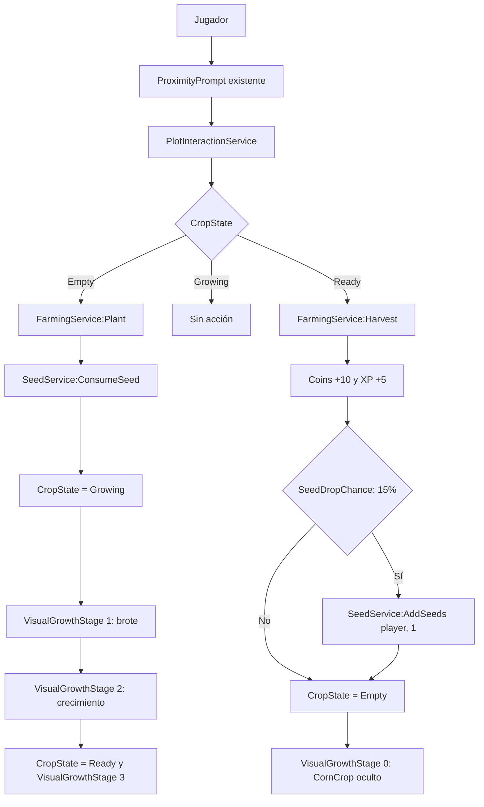

# Jardín Agrodiverso

## Descripción

**Jardín Agrodiverso** es un proyecto educativo en Roblox que transforma un jardín agrodiverso escolar en una experiencia virtual interactiva y gamificada. La primera etapa implementa una base técnica de datos de jugador, semillas y cultivo de maíz, manteniendo el mapa físico en Roblox Studio y el código sincronizado desde el repositorio.

## Propósito educativo

El proyecto busca conectar educación ambiental, gamificación, aprendizaje interactivo, prácticas agroecológicas, tecnología y desarrollo de competencias digitales. Su evolución debe priorizar mecánicas que ayuden a explorar y comprender el jardín sin afirmar experiencias educativas que aún no estén implementadas.

## Tecnologías

| Tecnología | Uso actual |
| --- | --- |
| Roblox Studio | Administración del mapa, parcelas, modelos visuales y ejecución de pruebas. |
| Luau | Implementación de servicios de servidor. |
| Visual Studio Code | Edición del código fuente. |
| Rojo 7.7.0 | Sincronización del código entre el repositorio y Roblox Studio. |
| Git | Control de versiones configurado en la rama `main`, con remoto de GitHub. |

## Arquitectura

El proyecto separa explícitamente el código sincronizado del mapa construido en Studio:

```text
Código:
VS Code → Rojo → Roblox Studio

Mapa:
Roblox Studio
```

`default.project.json` sincroniza `src/ReplicatedStorage`, `src/ServerScriptService` y `src/StarterPlayer`. No sincroniza `Workspace`; por tanto, las parcelas, prompts y modelos visuales se administran directamente en Roblox Studio. Esta separación evita que una sincronización de código reemplace accidentalmente el mapa.

`Main.server.lua` es el punto de entrada del servidor. Inicializa, en orden, PlayerData, las interacciones de parcela y la capa visual de cultivos. `FarmingService` permanece como autoridad del gameplay de cultivo; `CropVisualService` solo presenta el estado. `CropCatalog` concentra la definición de cada cultivo para no duplicar reglas entre ambos. `InventoryService` centraliza las operaciones de objetos sobre el `PlayerData` del jugador, sin mantener un almacenamiento paralelo.

## Estructura del proyecto

```text
Jardín Agrodiverso/
├── default.project.json
├── JardinAgrodiverso.rbxl
├── README.md
└── src/
    └── ServerScriptService/
        ├── Main.server.lua
        └── Systems/
            ├── PlayerData/
            │   └── PlayerDataService.lua
            ├── Inventory/
            │   └── InventoryService.lua
            ├── Seeds/
            │   ├── SeedService.lua
            │   └── SeedShopService.lua
            └── Farming/
                ├── CropCatalog.lua
                ├── FarmingService.lua
                ├── PlotInteractionService.lua
                └── CropVisualService.lua
```

Las rutas de `ReplicatedStorage` y `StarterPlayer` están declaradas en la configuración de Rojo, aunque actualmente no contienen archivos fuente en esta revisión.

## Estructura del mapa

El mapa no forma parte de `src`. La estructura relevante mantenida en Roblox Studio es:

```text
Workspace
├── Camera
├── Terrain
├── Map
├── NPCs
├── Spawn
├── Stations
│   └── Farm
│       └── CornPlot
├── SpawnLocation
└── Baseplate
```

Para el flujo de cultivo, `CornPlot` debe conservar los siguientes elementos creados y administrados en Studio:

```text
CornPlot
├── CropType = "Corn"          (atributo)
├── ProximityPrompt
└── CornCrop                    (Model)
    ├── Stem
    ├── Leaf1
    └── Leaf2
```

Los servicios no crean ni eliminan estos objetos. `CropVisualService` solo ajusta `Transparency` y la escala (`ScaleTo`) del modelo existente `CornCrop`.

## Sistemas implementados

### PlayerDataService

`PlayerDataService` es la autoridad de los datos de jugador durante la sesión del servidor. Escucha `PlayerAdded` y `PlayerRemoving`, crea datos al entrar y los libera al salir.

| Dato | Valor inicial |
| --- | ---: |
| Coins | 100 |
| Level | 1 |
| XP | 0 |
| Seeds | 0 |
| Inventory | `{}` |

Los datos permanecen en memoria y son de uso exclusivo del servidor. **No existe persistencia con DataStore**; al terminar la sesión, los datos se eliminan.

### InventoryService

`InventoryService` es la capa responsable de las operaciones del inventario durante la sesión. Obtiene los datos mediante `PlayerDataService:GetPlayerData(player)` y almacena los objetos nuevos en `PlayerData.Inventory`, un diccionario por jugador indexado por `itemId`. No existe un inventario global ni un segundo almacenamiento independiente.

| Método | Comportamiento |
| --- | --- |
| `GetItemCount(player, itemId)` | Devuelve la cantidad del objeto o `0` si no existe o no hay datos activos. |
| `AddItem(player, itemId, amount)` | Agrega una cantidad entera, positiva y finita al inventario del jugador. |
| `RemoveItem(player, itemId, amount)` | Elimina objetos solo si el jugador tiene unidades suficientes; devuelve `false` en caso contrario. |
| `HasItem(player, itemId, amount)` | Comprueba si el jugador posee al menos la cantidad solicitada. |

`itemId` debe ser un identificador no vacío y sin espacios. Las cantidades negativas, cero, decimales, infinitas o no numéricas se rechazan.

### SeedService

`SeedService` conserva su API para la agricultura, pero delega sus operaciones en `InventoryService`. El campo legado `PlayerData.Seeds` sigue siendo el almacenamiento canónico de semillas; no se duplica dentro de `PlayerData.Inventory`. Cuando `InventoryService` recibe el identificador `"Seeds"`, enruta la operación al campo `Seeds`.

| Operación | Comportamiento |
| --- | --- |
| `GetSeedCount(player)` | Devuelve la cantidad actual o `0` si no hay datos activos. |
| `AddSeeds(player, amount)` | Agrega solo cantidades enteras, positivas y finitas a un jugador con datos activos. |
| `ConsumeSeed(player)` | Consume una semilla únicamente cuando el jugador tiene al menos una. |

### SeedShopService

`SeedShopService` implementa el Banco de Semillas durante la sesión. El servicio es stateless: no mantiene datos globales de jugadores, saldos ni inventarios propios. Toda compra se valida y ejecuta en el servidor, usando `PlayerDataService` como autoridad de los datos.

El catálogo actual de semillas es:

| Identificador | `ItemId` | Precio |
| --- | --- | ---: |
| `CornSeed` | `Seeds` | 5 Coins |

`CornSeed` conserva el `ItemId = "Seeds"` para mantener la compatibilidad con `PlayerData.Seeds`, `SeedService` y `FarmingService`.

| Método | Comportamiento |
| --- | --- |
| `GetSeedPrice(seedId)` | Devuelve el precio configurado de la semilla o `nil` si el identificador no existe. |
| `CanAffordSeeds(player, seedId, amount)` | Comprueba que el jugador tenga datos activos, la semilla exista, la cantidad sea válida y haya suficientes Coins. |
| `BuySeeds(player, seedId, amount)` | Valida la compra, agrega todas las semillas mediante `SeedService` y descuenta los Coins únicamente cuando la operación puede completarse. |

El `seedId` debe existir en el catálogo. La cantidad debe ser positiva, entera y finita; se rechazan valores cero, negativos, decimales, `NaN` e infinitos. Las compras inválidas o sin saldo suficiente no modifican Coins ni Seeds.

`SeedShopService` consulta `PlayerDataService:GetPlayerData(player)` para validar el saldo y delega la adición de semillas en `SeedService:AddSeeds`. `SeedService` continúa utilizando `InventoryService`, que enruta el identificador compatible `"Seeds"` al campo canónico `PlayerData.Seeds`. No se crea un almacenamiento paralelo.

### CropCatalog

`CropCatalog` es la definición compartida de cada cultivo. No es autoridad de sesión ni crea objetos del mapa: describe duración, recompensas, nombre del modelo visual existente y etapas visuales.

`FarmingService` lee de este catálogo las reglas de gameplay. `CropVisualService` lee la apariencia. Añadir un cultivo posterior debe hacerse aquí, sin reescribir el ciclo de plantación ni la capa visual.

Actualmente solo existe la definición `Corn`.

### FarmingService

`FarmingService` es la autoridad del gameplay de cultivo. Planta, madura y cosecha según `CropState`; no delega esas decisiones en la capa visual. Actualmente solo existe configuración para `CropType = "Corn"`, leída desde `CropCatalog`:

| Parámetro | Valor |
| --- | ---: |
| Duración de crecimiento | 30 segundos |
| Recompensa de cosecha | 10 Coins |
| Recompensa de experiencia | 5 XP |
| Probabilidad de semilla al cosechar | 15% (`SeedDropChance = 0.15`) |

Estados válidos de `CropState`:

```text
Empty
↓ Plant
Growing
↓ 30 segundos
Ready
↓ Harvest
Empty
```

Al plantar, valida que el jugador siga activo, tenga datos de sesión, la parcela sea compatible y esté vacía. Después consume exactamente una semilla mediante `SeedService`. Durante `Growing` publica `VisualGrowthStage` como señal de presentación derivada del mismo ciclo; esa señal no autoriza plantar ni cosechar. Al cosechar en `Ready`, suma `Coins` y `XP` a los datos del jugador; además, para `Corn`, evalúa `SeedDropChance` y, si se cumple, agrega exactamente una semilla mediante `SeedService:AddSeeds(player, 1)`. Finalmente devuelve el estado a `Empty` y `VisualGrowthStage` a `0`.

El estado se almacena como atributos de la parcela: `CropState`, `FarmingCycle` y `VisualGrowthStage`. `FarmingCycle` identifica cada plantación y evita que un temporizador de un ciclo anterior, incluida una etapa visual, modifique incorrectamente un ciclo posterior.

### PlotInteractionService

`PlotInteractionService` es el puente entre el mapa y la lógica de cultivo. Busca `Workspace.Stations.Farm`, recorre los `ProximityPrompt` existentes e identifica su parcela ascendiendo hasta un ancestro con atributo `CropType`.

El evento `Triggered` consulta `FarmingService:GetCropState(plot)` y decide la acción sin duplicar reglas de negocio: en `Empty` llama a `FarmingService:Plant(player, plot)`, en `Growing` no ejecuta ninguna acción y en `Ready` llama a `FarmingService:Harvest(player, plot)`. El servicio evita conexiones duplicadas si se inicializa más de una vez.

### CropVisualService

`CropVisualService` es la capa visual. Recorre parcelas con `CropType` dentro de `Workspace.Stations.Farm`, resuelve el modelo configurado en `CropCatalog` (`CornCrop` para maíz) y conserva transparencia y escala originales. No crea modelos, piezas ni prompts, y no decide si se puede plantar o cosechar: si `CropState` es `Empty`, oculta el cultivo aunque `VisualGrowthStage` indique otra cosa.

Escucha `CropState` y `VisualGrowthStage`. Aplica escala con `ScaleTo` y muestra u oculta `BasePart` existentes según la etapa.

#### VisualGrowthStage

`VisualGrowthStage` es un atributo de parcela escrito por `FarmingService`. Representa la etapa visible; el estado lógico sigue siendo solo `Empty`, `Growing` o `Ready`.

Etapas visuales actuales del maíz:

| Etapa | `VisualGrowthStage` | `CropState` | Momento | Apariencia |
| --- | ---: | --- | --- | --- |
| Oculto | 0 | `Empty` | Parcela vacía | `CornCrop` oculto |
| 1. Brote | 1 | `Growing` | Al plantar (0 s) | Solo `Stem`, escala 0.3 |
| 2. Crecimiento | 2 | `Growing` | 15 s (50 % de 30 s) | Piezas visibles, escala 0.7 |
| 3. Cultivo maduro | 3 | `Ready` | 30 s | Modelo completo, escala 1 |

Las tres etapas visuales del maíz en cultivo activo son brote, crecimiento y maduro. La etapa 0 solo describe la parcela vacía.

## Flujo de cultivo



El diagrama representa el flujo implementado en código. La existencia de evidencia registrada de pruebas de ejecución debe confirmarse por separado en la sección siguiente.

## Pruebas realizadas

### Verificado directamente en código

| Área | Evidencia técnica |
| --- | --- |
| PlayerData inicial | `PlayerDataService.lua` define Coins = 100, Level = 1, XP = 0 y Seeds = 0. |
| Semillas | `SeedService.lua` implementa consulta, adición validada y consumo condicionado. |
| Cultivo | `FarmingService.lua` implementa los estados, 30 segundos para Corn, recompensas, `SeedDropChance = 0.15`, `VisualGrowthStage` y limpieza posterior. |
| Catálogo | `CropCatalog.lua` define gameplay y etapas visuales de `Corn`. |
| Interacción física | `PlotInteractionService.lua` consulta `CropState` y delega en `FarmingService:Plant` o `FarmingService:Harvest`. |
| Visualización | `CropVisualService.lua` aplica etapas visuales sin alterar las reglas de cultivo. |

### Pendiente de verificación registrada

Durante el desarrollo se realizaron pruebas manuales en Roblox Studio para validar PlayerDataService, SeedService, FarmingService, el ciclo de cultivo y la visualización del cultivo. Sin embargo, estas pruebas no cuentan actualmente con registros externos, capturas ni evidencia conservada dentro del repositorio. Por ello, deben considerarse pruebas de desarrollo y no evidencia formal reproducible; deberán repetirse y registrarse formalmente cuando corresponda.

La interacción física de cosecha mediante el mismo `ProximityPrompt` fue probada exitosamente en Roblox Studio. Con la parcela en `Ready`, la interacción delegó en `FarmingService:Harvest(player, plot)`, otorgó `10 Coins` y `5 XP`, devolvió la parcela a `Empty` y ocultó `CornCrop`. Tras quedar con `0` semillas, la parcela no permitió una nueva plantación.

También se validó manualmente que las semillas se consumen al plantar y pueden recuperarse mediante el drop aleatorio de cosecha. Esta prueba confirma el funcionamiento del mecanismo aleatorio y la integración con `SeedService`, pero no constituye una demostración estadística exacta de la probabilidad del 15%.

El crecimiento visual por etapas del maíz fue probado exitosamente en Roblox Studio. El ciclo completo funcionó: parcela vacía oculta; al plantar, brote (`VisualGrowthStage = 1`); durante `Growing`, etapa de crecimiento (`VisualGrowthStage = 2`); a los 30 segundos, cultivo maduro (`CropState = Ready`, `VisualGrowthStage = 3`); al cosechar, retorno a `Empty` con `CornCrop` oculto. La plantación, la cosecha, las recompensas y la obtención natural de semillas se mantuvieron compatibles con el comportamiento previo.

- PlayerData: confirmar los cuatro valores iniciales al entrar un jugador.
- SeedService: probar `AddSeeds(player, 5)` y `ConsumeSeed(player)`.
- FarmingService por consola de servidor: agregar semilla, plantar, confirmar consumo, esperar 30 segundos, cosechar directamente y comprobar `Coins +10`, `XP +5`, retorno a `Empty` y el mecanismo de drop aleatorio de semillas.
- Plantación física: activar el `ProximityPrompt` de `CornPlot` con una semilla disponible.
- Visualización: comprobar las tres etapas del maíz (brote, crecimiento y maduro) y que `CornCrop` se oculta en `Empty`.

La prueba directa de `Harvest` existe en la API del servicio y la cosecha mediante interacción física está implementada y fue probada exitosamente durante el desarrollo.

## Estado del desarrollo

| Sistema | Estado |
| --- | --- |
| Configuración Roblox Studio | Pendiente de verificación documental |
| Configuración Rojo | Implementado en `default.project.json` |
| Arquitectura inicial de servidor | Implementada |
| PlayerDataService | Implementado; prueba de ejecución pendiente de registro |
| SeedService | Implementado; prueba de ejecución pendiente de registro |
| FarmingService | Implementado; recompensas, drop de semillas y autoridad de `CropState` probados manualmente sin registro formal |
| CropCatalog | Implementado para `Corn`; base reutilizable para cultivos posteriores |
| Plantación mediante ProximityPrompt | Implementada; prueba de ejecución pendiente de registro |
| CropVisualService | Implementado como capa visual; etapas del maíz probadas manualmente en Studio |
| Crecimiento visual por etapas | Implementado; prueba manual exitosa en Roblox Studio |
| Crecimiento `Growing → Ready` | Implementado; prueba manual exitosa junto con las etapas visuales |
| Cosecha mediante interacción | Implementada; prueba manual exitosa sin registro formal |
| Obtención natural de semillas | Implementada; validación funcional manual sin demostración estadística formal |
| Banco de Semillas | Implementado; catálogo de `CornSeed` a 5 Coins y compras validadas en servidor |
| Economía completa | Pendiente |
| Inventario | Implementado; objetos nuevos en `PlayerData.Inventory` y `Seeds` compatible mediante `InventoryService` |
| Misiones | Pendiente |
| NPCs | Pendiente |
| Sistemas agroecológicos | Pendiente |
| UI | Pendiente |
| Tutorial | Pendiente |
| Persistencia DataStore | Pendiente |

## Historial de cambios

Git está configurado para este proyecto. La rama principal es `main` y el remoto `origin` está configurado como `https://github.com/LuisDiaz122001/Jardin-Agrodiverso.git`.

Los commits verificables registran la versión inicial, su documentación, la cosecha mediante `ProximityPrompt`, la obtención natural de semillas y el crecimiento visual por etapas. El historial anterior a la inicialización de Git no se reconstruye ni se atribuye a fechas no verificables.

| Fecha | Commit | Mensaje |
| --- | --- | --- |
| 2026-09-12 | `7d81d2c` | `feat: implementa banco de semillas` |
| 2026-09-11 | `83fbf84` | `feat: implementa inventario base` |
| 2026-09-11 | `74a3921` | `feat: implementa crecimiento visual por etapas` |
| 2026-09-11 | `7bbc04e` | `docs: actualiza documentación de obtención de semillas` |
| 2026-09-11 | `4771ca9` | `feat: agrega obtencion natural de semillas` |
| 2026-09-11 | `949e297` | `docs: actualiza historial de cambios` |
| 2026-09-11 | `7d87c4e` | `feat: implementa cosecha mediante ProximityPrompt` |
| 2026-09-11 | `062cfc6` | `docs: actualiza documentación y control de versiones` |
| 2026-09-11 | `c951e7d` | `chore: inicializa Jardin Agrodiverso` |

A partir de este commit, los cambios relevantes deben registrarse mediante commits descriptivos. El README resume hitos, pero el historial de Git es la evidencia principal de la evolución del código.

## Cómo consultar el historial de cambios

El historial de Git es la evidencia principal de la evolución del código. El README resume hitos relevantes, pero no reemplaza dicho historial.

Revisar el estado antes de registrar cambios:

```bash
git status
```

```bash
git log --oneline --date=short --pretty=format:"%h | %ad | %s"
```

Para revisar archivos modificados por cada commit:

```bash
git log --stat
```

Flujo recomendado:

1. Realizar un cambio.
2. Probarlo en Roblox Studio.
3. Verificar que funciona.
4. Revisar `git status`.
5. Crear un commit descriptivo.
6. Hacer `git push`.

```bash
git add .
git commit -m "tipo: descripción del cambio"
git push
```

Al actualizar esta sección, solo se deben registrar fechas y asociaciones de funcionalidades que puedan comprobarse mediante commits u otra evidencia conservada en el proyecto.

## Reglas de desarrollo

1. El código se desarrolla en VS Code.
2. Rojo sincroniza el código con Roblox Studio.
3. Workspace se administra directamente desde Roblox Studio.
4. No modificar Workspace mediante Rojo sin autorización explícita.
5. No modificar `default.project.json` sin revisar previamente las consecuencias.
6. Los datos del jugador deben permanecer bajo `PlayerDataService`.
7. Los servicios deben tener responsabilidades claras.
8. Las interacciones del mapa deben pasar por servicios apropiados.
9. Los objetos visuales existentes no deben recrearse innecesariamente mediante código.
10. Cada sistema debe probarse antes de comenzar el siguiente.
11. No introducir funcionalidades que no hayan sido solicitadas.
12. Evitar mezclar presentación, datos y reglas de negocio en un único servicio.
13. Registrar en Git los cambios relevantes con mensajes claros.
14. No modificar las fechas ni el historial de Git para aparentar actividad.
15. Mantener actualizado el historial de cambios con fechas verificables.
16. Cuando una fecha o prueba no pueda comprobarse, indicarlo explícitamente en lugar de inventarla.

## Cómo ejecutar el proyecto

1. Abrir `JardinAgrodiverso.rbxl` en Roblox Studio.
2. Verificar en Explorer la estructura de `Workspace.Stations.Farm` y los elementos requeridos de `CornPlot`.
3. Desde la raíz del proyecto, iniciar Rojo con la configuración existente:

   ```bash
   rojo serve default.project.json
   ```

4. Conectar la sesión desde el complemento de Rojo en Roblox Studio.
5. Ejecutar una sesión de prueba en Studio.

## Cómo trabajar con Rojo

- Editar únicamente el código que pertenece a `src` desde VS Code.
- Mantener los objetos físicos del mapa, prompts y modelos visuales en Roblox Studio.
- Verificar la conexión de Rojo antes de probar cambios de servidor.
- No introducir `Workspace` en la configuración de Rojo sin una revisión explícita de impacto sobre el mapa.
- Confirmar que `Main.server.lua` sigue siendo el punto de inicialización de los servicios de servidor.

## Cómo probar los sistemas

Las pruebas deben realizarse en una sesión de servidor de Roblox Studio, nunca desde código cliente.

```lua
local SeedService = require(game.ServerScriptService.Systems.Seeds.SeedService)
local InventoryService = require(game.ServerScriptService.Systems.Inventory.InventoryService)
local FarmingService = require(game.ServerScriptService.Systems.Farming.FarmingService)

local player = game.Players:GetPlayers()[1]
local plot = workspace.Stations.Farm.CornPlot

print(InventoryService:GetItemCount(player, "Seeds"))
print(InventoryService:AddItem(player, "Wood", 10))
print(InventoryService:HasItem(player, "Wood", 10))
print(InventoryService:RemoveItem(player, "Wood", 4))
print(InventoryService:GetItemCount(player, "Wood"))
print(InventoryService:RemoveItem(player, "Wood", 100))

print(SeedService:AddSeeds(player, 1))
print(FarmingService:Plant(player, plot))
print(FarmingService:GetCropState(plot), FarmingService:GetVisualGrowthStage(plot)) -- Growing, 1

task.wait(15)
print(FarmingService:GetCropState(plot), FarmingService:GetVisualGrowthStage(plot)) -- Growing, 2

task.wait(15)
print(FarmingService:GetCropState(plot), FarmingService:GetVisualGrowthStage(plot)) -- Ready, 3
print(FarmingService:Harvest(player, plot))
print(FarmingService:GetCropState(plot), FarmingService:GetVisualGrowthStage(plot)) -- Empty, 0
```

Después, repetir la plantación usando el `ProximityPrompt` con una semilla disponible, esperar el estado `Ready` y usar el mismo prompt para cosechar. Verificar `Coins +10`, `XP +5`, el retorno a `Empty`, que `CornCrop` se oculte y que, con `0` semillas, no sea posible plantar nuevamente. Registrar el resultado de estas pruebas antes de actualizar su evidencia formal en este documento.

## Próximos pasos

1. Registrar y conservar evidencia de las pruebas de servidor, interacción física y visualización.
2. Registrar evidencia formal reproducible de la cosecha y del drop aleatorio de semillas mediante `ProximityPrompt`.
3. Definir los siguientes cultivos mediante nuevas entradas en `CropCatalog`.
4. Diseñar persistencia con DataStore dentro de la responsabilidad de PlayerDataService.
5. Diseñar el Banco de Semillas como una etapa independiente, sin sustituir la autoridad actual de `SeedService`.
6. Incorporar economía, inventario, UI, misiones, NPCs y sistemas agroecológicos solo como etapas separadas y solicitadas.

## Documentación futura

**Pendiente de documentación:** documentar resultados de pruebas manuales con evidencia conservada; asociar nuevos hitos a commits verificables; y confirmar periódicamente desde Studio que la estructura del mapa coincide con esta referencia.
