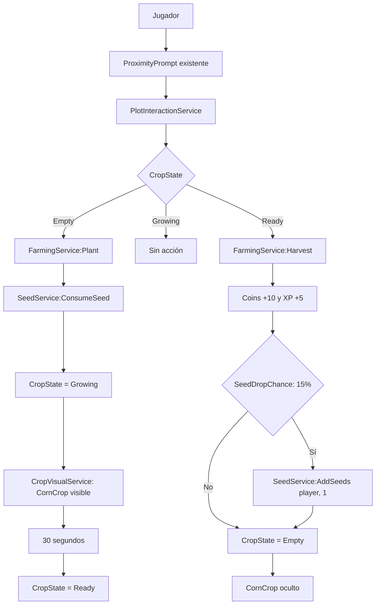

# Jardín Agrodiverso

## Descripción

**Jardín Agrodiverso** es un proyecto educativo en Roblox que transforma un jardín agrodiverso escolar en una experiencia virtual interactiva y gamificada. La primera etapa implementa una base técnica de datos de jugador, semillas y cultivo de maíz, manteniendo el mapa físico en Roblox Studio y el código sincronizado desde el repositorio.

## Propósito educativo

El proyecto busca conectar educación ambiental, gamificación, aprendizaje interactivo, prácticas agroecológicas, tecnología y desarrollo de competencias digitales. Su evolución debe priorizar mecánicas que ayuden a explorar y comprender el jardín sin afirmar experiencias educativas que aún no estén implementadas.

## Tecnologías

| Tecnología | Uso actual |
| --- | --- |
| Roblox Studio | Administración del mapa, parcelas, modelos visuales y ejecución de pruebas. |
| Luau | Implementación de servicios de servidor. |
| Visual Studio Code | Edición del código fuente. |
| Rojo 7.7.0 | Sincronización del código entre el repositorio y Roblox Studio. |
| Git | Control de versiones configurado en la rama `main`, con remoto de GitHub. |

## Arquitectura

El proyecto separa explícitamente el código sincronizado del mapa construido en Studio:

```text
Código:
VS Code → Rojo → Roblox Studio

Mapa:
Roblox Studio
```

`default.project.json` sincroniza `src/ReplicatedStorage`, `src/ServerScriptService` y `src/StarterPlayer`. No sincroniza `Workspace`; por tanto, las parcelas, prompts y modelos visuales se administran directamente en Roblox Studio. Esta separación evita que una sincronización de código reemplace accidentalmente el mapa.

`Main.server.lua` es el punto de entrada del servidor. Inicializa, en orden, PlayerData, las interacciones de parcela y la capa visual de cultivos.

## Estructura del proyecto

```text
Jardín Agrodiverso/
├── default.project.json
├── JardinAgrodiverso.rbxl
├── README.md
└── src/
    └── ServerScriptService/
        ├── Main.server.lua
        └── Systems/
            ├── PlayerData/
            │   └── PlayerDataService.lua
            ├── Seeds/
            │   └── SeedService.lua
            └── Farming/
                ├── FarmingService.lua
                ├── PlotInteractionService.lua
                └── CropVisualService.lua
```

Las rutas de `ReplicatedStorage` y `StarterPlayer` están declaradas en la configuración de Rojo, aunque actualmente no contienen archivos fuente en esta revisión.

## Estructura del mapa

El mapa no forma parte de `src`. La estructura relevante mantenida en Roblox Studio es:

```text
Workspace
├── Camera
├── Terrain
├── Map
├── NPCs
├── Spawn
├── Stations
│   └── Farm
│       └── CornPlot
├── SpawnLocation
└── Baseplate
```

Para el flujo de cultivo, `CornPlot` debe conservar los siguientes elementos creados y administrados en Studio:

```text
CornPlot
├── CropType = "Corn"          (atributo)
├── ProximityPrompt
└── CornCrop                    (Model)
    ├── Stem
    ├── Leaf1
    └── Leaf2
```

Los servicios no crean ni eliminan estos objetos. `CropVisualService` solo cambia `Transparency` de los `BasePart` existentes dentro de `CornCrop`.

## Sistemas implementados

### PlayerDataService

`PlayerDataService` es la autoridad de los datos de jugador durante la sesión del servidor. Escucha `PlayerAdded` y `PlayerRemoving`, crea datos al entrar y los libera al salir.

| Dato | Valor inicial |
| --- | ---: |
| Coins | 100 |
| Level | 1 |
| XP | 0 |
| Seeds | 0 |

Los datos permanecen en memoria y son de uso exclusivo del servidor. **No existe persistencia con DataStore**; al terminar la sesión, los datos se eliminan.

### SeedService

`SeedService` opera sobre el campo `Seeds` de `PlayerDataService`; no mantiene una copia ni una tabla paralela de semillas.

| Operación | Comportamiento |
| --- | --- |
| `GetSeedCount(player)` | Devuelve la cantidad actual o `0` si no hay datos activos. |
| `AddSeeds(player, amount)` | Agrega solo cantidades enteras, positivas y finitas a un jugador con datos activos. |
| `ConsumeSeed(player)` | Consume una semilla únicamente cuando el jugador tiene al menos una. |

### FarmingService

`FarmingService` coordina las reglas de cultivo en el servidor. Actualmente solo existe configuración para `CropType = "Corn"`:

| Parámetro | Valor |
| --- | ---: |
| Duración de crecimiento | 30 segundos |
| Recompensa de cosecha | 10 Coins |
| Recompensa de experiencia | 5 XP |
| Probabilidad de semilla al cosechar | 15% (`SeedDropChance = 0.15`) |

Estados válidos de `CropState`:

```text
Empty
↓ Plant
Growing
↓ 30 segundos
Ready
↓ Harvest
Empty
```

Al plantar, valida que el jugador siga activo, tenga datos de sesión, la parcela sea compatible y esté vacía. Después consume exactamente una semilla mediante `SeedService`. Al cosechar en `Ready`, suma `Coins` y `XP` a los datos del jugador; además, para `Corn`, evalúa `SeedDropChance` y, si se cumple, agrega exactamente una semilla mediante `SeedService:AddSeeds(player, 1)`. Finalmente devuelve el estado a `Empty`.

El estado se almacena como atributos de la parcela: `CropState` y `FarmingCycle`. `FarmingCycle` identifica cada plantación y evita que un temporizador de un ciclo anterior modifique incorrectamente un ciclo posterior.

### PlotInteractionService

`PlotInteractionService` es el puente entre el mapa y la lógica de cultivo. Busca `Workspace.Stations.Farm`, recorre los `ProximityPrompt` existentes e identifica su parcela ascendiendo hasta un ancestro con atributo `CropType`.

El evento `Triggered` consulta `FarmingService:GetCropState(plot)` y decide la acción sin duplicar reglas de negocio: en `Empty` llama a `FarmingService:Plant(player, plot)`, en `Growing` no ejecuta ninguna acción y en `Ready` llama a `FarmingService:Harvest(player, plot)`. El servicio evita conexiones duplicadas si se inicializa más de una vez.

### CropVisualService

`CropVisualService` recorre las parcelas de maíz dentro de `Workspace.Stations.Farm`, busca el modelo existente `CornCrop` y conserva en memoria la transparencia original de sus `BasePart`.

| Estado de parcela | Estado visual de `CornCrop` |
| --- | --- |
| `Empty` o sin `CropState` | Oculto (`Transparency = 1`) |
| `Growing` | Visible (transparencia original) |
| `Ready` | Visible (transparencia original) |

El servicio inicializa el estado al arrancar y escucha `GetAttributeChangedSignal("CropState")`. No crea modelos, piezas ni prompts.

## Flujo de cultivo



El diagrama representa el flujo implementado en código. La existencia de evidencia registrada de pruebas de ejecución debe confirmarse por separado en la sección siguiente.

## Pruebas realizadas

### Verificado directamente en código

| Área | Evidencia técnica |
| --- | --- |
| PlayerData inicial | `PlayerDataService.lua` define Coins = 100, Level = 1, XP = 0 y Seeds = 0. |
| Semillas | `SeedService.lua` implementa consulta, adición validada y consumo condicionado. |
| Cultivo | `FarmingService.lua` implementa los estados, 30 segundos para Corn, recompensas, `SeedDropChance = 0.15` y limpieza posterior. |
| Interacción física | `PlotInteractionService.lua` consulta `CropState` y delega en `FarmingService:Plant` o `FarmingService:Harvest`. |
| Visualización | `CropVisualService.lua` sincroniza visibilidad con `CropState`. |

### Pendiente de verificación registrada

Durante el desarrollo se realizaron pruebas manuales en Roblox Studio para validar PlayerDataService, SeedService, FarmingService, el ciclo de cultivo y la visualización del cultivo. Sin embargo, estas pruebas no cuentan actualmente con registros externos, capturas ni evidencia conservada dentro del repositorio. Por ello, deben considerarse pruebas de desarrollo y no evidencia formal reproducible; deberán repetirse y registrarse formalmente cuando corresponda.

La interacción física de cosecha mediante el mismo `ProximityPrompt` fue probada exitosamente en Roblox Studio. Con la parcela en `Ready`, la interacción delegó en `FarmingService:Harvest(player, plot)`, otorgó `10 Coins` y `5 XP`, devolvió la parcela a `Empty` y ocultó `CornCrop`. Tras quedar con `0` semillas, la parcela no permitió una nueva plantación.

También se validó manualmente que las semillas se consumen al plantar y pueden recuperarse mediante el drop aleatorio de cosecha. Esta prueba confirma el funcionamiento del mecanismo aleatorio y la integración con `SeedService`, pero no constituye una demostración estadística exacta de la probabilidad del 15%.

- PlayerData: confirmar los cuatro valores iniciales al entrar un jugador.
- SeedService: probar `AddSeeds(player, 5)` y `ConsumeSeed(player)`.
- FarmingService por consola de servidor: agregar semilla, plantar, confirmar consumo, esperar 30 segundos, cosechar directamente y comprobar `Coins +10`, `XP +5`, retorno a `Empty` y el mecanismo de drop aleatorio de semillas.
- Plantación física: activar el `ProximityPrompt` de `CornPlot` con una semilla disponible.
- Visualización: comprobar que `CornCrop` se oculta en `Empty` y se muestra en `Growing` y `Ready`.

La prueba directa de `Harvest` existe en la API del servicio y la cosecha mediante interacción física está implementada y fue probada exitosamente durante el desarrollo.

## Estado del desarrollo

| Sistema | Estado |
| --- | --- |
| Configuración Roblox Studio | Pendiente de verificación documental |
| Configuración Rojo | Implementado en `default.project.json` |
| Arquitectura inicial de servidor | Implementada |
| PlayerDataService | Implementado; prueba de ejecución pendiente de registro |
| SeedService | Implementado; prueba de ejecución pendiente de registro |
| FarmingService | Implementado; recompensas y drop aleatorio de semillas probados manualmente sin registro formal |
| Plantación mediante ProximityPrompt | Implementada; prueba de ejecución pendiente de registro |
| CropVisualService | Implementado; prueba de ejecución pendiente de registro |
| Crecimiento `Growing → Ready` | Implementado; prueba de ejecución pendiente de registro |
| Cosecha mediante interacción | Implementada; prueba manual exitosa sin registro formal |
| Obtención natural de semillas | Implementada; validación funcional manual sin demostración estadística formal |
| Banco de Semillas | Pendiente |
| Economía completa | Pendiente |
| Inventario | Pendiente |
| Misiones | Pendiente |
| NPCs | Pendiente |
| Sistemas agroecológicos | Pendiente |
| UI | Pendiente |
| Tutorial | Pendiente |
| Persistencia DataStore | Pendiente |

## Historial de cambios

Git está configurado para este proyecto. La rama principal es `main` y el remoto `origin` está configurado como `https://github.com/LuisDiaz122001/Jardin-Agrodiverso.git`.

Los commits verificables registran la versión inicial, su documentación y la implementación de cosecha mediante `ProximityPrompt`. El historial anterior a la inicialización de Git no se reconstruye ni se atribuye a fechas no verificables.

| Fecha | Commit | Mensaje |
| --- | --- | --- |
| 2026-09-11 | `4771ca9` | `feat: agrega obtencion natural de semillas` |
| 2026-09-11 | `949e297` | `docs: actualiza historial de cambios` |
| 2026-09-11 | `7d87c4e` | `feat: implementa cosecha mediante ProximityPrompt` |
| 2026-09-11 | `062cfc6` | `docs: actualiza documentación y control de versiones` |
| 2026-09-11 | `c951e7d` | `chore: inicializa Jardin Agrodiverso` |

A partir de este commit, los cambios relevantes deben registrarse mediante commits descriptivos. El README resume hitos, pero el historial de Git es la evidencia principal de la evolución del código.

## Cómo consultar el historial de cambios

El historial de Git es la evidencia principal de la evolución del código. El README resume hitos relevantes, pero no reemplaza dicho historial.

Revisar el estado antes de registrar cambios:

```bash
git status
```

```bash
git log --oneline --date=short --pretty=format:"%h | %ad | %s"
```

Para revisar archivos modificados por cada commit:

```bash
git log --stat
```

Flujo recomendado:

1. Realizar un cambio.
2. Probarlo en Roblox Studio.
3. Verificar que funciona.
4. Revisar `git status`.
5. Crear un commit descriptivo.
6. Hacer `git push`.

```bash
git add .
git commit -m "tipo: descripción del cambio"
git push
```

Al actualizar esta sección, solo se deben registrar fechas y asociaciones de funcionalidades que puedan comprobarse mediante commits u otra evidencia conservada en el proyecto.

## Reglas de desarrollo

1. El código se desarrolla en VS Code.
2. Rojo sincroniza el código con Roblox Studio.
3. Workspace se administra directamente desde Roblox Studio.
4. No modificar Workspace mediante Rojo sin autorización explícita.
5. No modificar `default.project.json` sin revisar previamente las consecuencias.
6. Los datos del jugador deben permanecer bajo `PlayerDataService`.
7. Los servicios deben tener responsabilidades claras.
8. Las interacciones del mapa deben pasar por servicios apropiados.
9. Los objetos visuales existentes no deben recrearse innecesariamente mediante código.
10. Cada sistema debe probarse antes de comenzar el siguiente.
11. No introducir funcionalidades que no hayan sido solicitadas.
12. Evitar mezclar presentación, datos y reglas de negocio en un único servicio.
13. Registrar en Git los cambios relevantes con mensajes claros.
14. No modificar las fechas ni el historial de Git para aparentar actividad.
15. Mantener actualizado el historial de cambios con fechas verificables.
16. Cuando una fecha o prueba no pueda comprobarse, indicarlo explícitamente en lugar de inventarla.

## Cómo ejecutar el proyecto

1. Abrir `JardinAgrodiverso.rbxl` en Roblox Studio.
2. Verificar en Explorer la estructura de `Workspace.Stations.Farm` y los elementos requeridos de `CornPlot`.
3. Desde la raíz del proyecto, iniciar Rojo con la configuración existente:

   ```bash
   rojo serve default.project.json
   ```

4. Conectar la sesión desde el complemento de Rojo en Roblox Studio.
5. Ejecutar una sesión de prueba en Studio.

## Cómo trabajar con Rojo

- Editar únicamente el código que pertenece a `src` desde VS Code.
- Mantener los objetos físicos del mapa, prompts y modelos visuales en Roblox Studio.
- Verificar la conexión de Rojo antes de probar cambios de servidor.
- No introducir `Workspace` en la configuración de Rojo sin una revisión explícita de impacto sobre el mapa.
- Confirmar que `Main.server.lua` sigue siendo el punto de inicialización de los servicios de servidor.

## Cómo probar los sistemas

Las pruebas deben realizarse en una sesión de servidor de Roblox Studio, nunca desde código cliente.

```lua
local SeedService = require(game.ServerScriptService.Systems.Seeds.SeedService)
local FarmingService = require(game.ServerScriptService.Systems.Farming.FarmingService)

local player = game.Players:GetPlayers()[1]
local plot = workspace.Stations.Farm.CornPlot

print(SeedService:AddSeeds(player, 1))
print(FarmingService:Plant(player, plot))
print(FarmingService:GetCropState(plot)) -- Growing

task.wait(30)
print(FarmingService:GetCropState(plot)) -- Ready
print(FarmingService:Harvest(player, plot))
print(FarmingService:GetCropState(plot)) -- Empty
```

Después, repetir la plantación usando el `ProximityPrompt` con una semilla disponible, esperar el estado `Ready` y usar el mismo prompt para cosechar. Verificar `Coins +10`, `XP +5`, el retorno a `Empty`, que `CornCrop` se oculte y que, con `0` semillas, no sea posible plantar nuevamente. Registrar el resultado de estas pruebas antes de actualizar su evidencia formal en este documento.

## Próximos pasos

1. Registrar y conservar evidencia de las pruebas de servidor, interacción física y visualización.
2. Registrar evidencia formal reproducible de la cosecha y del drop aleatorio de semillas mediante `ProximityPrompt`.
3. Definir los siguientes cultivos mediante configuraciones de FarmingService.
4. Diseñar persistencia con DataStore dentro de la responsabilidad de PlayerDataService.
5. Diseñar el Banco de Semillas como una etapa independiente, sin sustituir la autoridad actual de `SeedService`.
6. Incorporar economía, inventario, UI, misiones, NPCs y sistemas agroecológicos solo como etapas separadas y solicitadas.

## Documentación futura

**Pendiente de documentación:** documentar resultados de pruebas manuales con evidencia conservada; asociar nuevos hitos a commits verificables; y confirmar periódicamente desde Studio que la estructura del mapa coincide con esta referencia.
